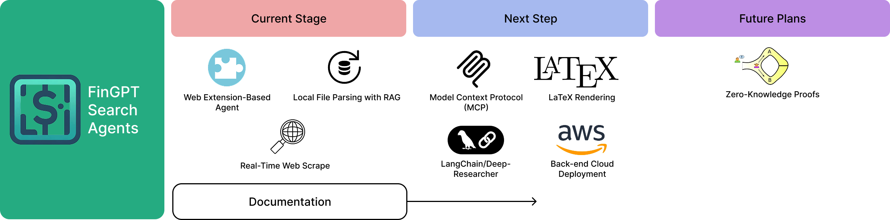

Overview
========

FinGPT Search Agent is a web-based agent in finance, business, accounting domains to assist users in information retrieval and data analysis. When generating responses, it provides the information sources to help users evaluate the responses' quality.

Key Features
------------

- It is a powerful **information search-and-retrieval engine**: A search agent for websites (Math Cup, Yahoo Finance, Bloomberg, XBRL International) and local files (SEC 10K, XBRL files (eXtensible Business Reporting Language)).
- Also a powerful **answer engine**: an answer agent that performs open search (open-domain search plus local file search) to quickly locate relevant financial information from various sources, such as websites, reports, filings, and local databases.
- For generated responses, users may perform quick **source verification**, ensuring reliability and accuracy.

.. image:: _static/images/agent_mcp_interaction.jpg
   :alt: Web agent interaction diagram
   :align: left
   :width: 800px

**NO DIRECT TRADING ADVICE**

Motivation
----------

Most of the current LLM-powered agents are general-purpose. They do not have a built-in knowledge base, meaning they cannot be personalized for users that don't possess strong coding skills. The few available agents that can parse a local knowledge base or have a built-in knowledge base are not popularized and far from the mainstream. FinGPT Agents aim to change this by providing a **user-friendly interface** with a **local** knowledge base that can be **easily customized**, and generate insights incorporating both **open-domain information** and **local information**. 

For students, imagine how much time may be saved from reviewing for an exam, if all you need to do is to copy all your notes into a local folder, and the agent will generate a tailored, personalized exam preparation plan for you, be it a crib sheet or a comprehensive study guide. For professionals, imagine how much time may be saved from reviewing a large number of documents, if all you need to do is to copy all your documents into a local folder, and the agent will generate a tailored, personalized report for you. 

*With FinGPT Agents, we aim to level up the general public's knowledge in finance, accounting, and business.*

Road Map
--------

Current roadmap begins at March, 2025.

