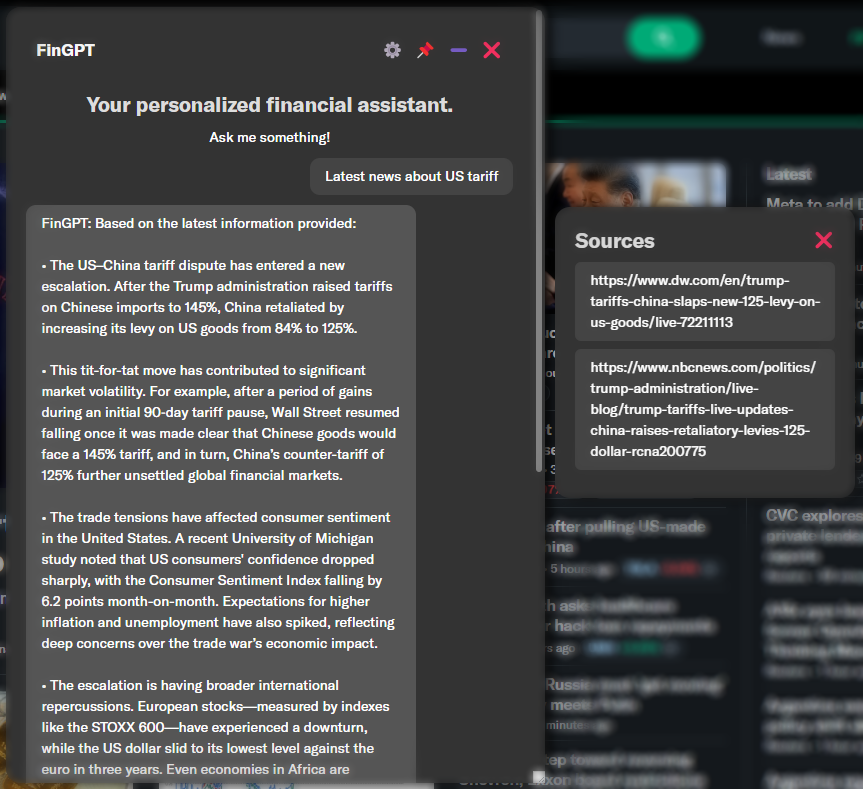

# FinGPT Search Agents

Vision: A financial agent to assist users in information retrieval and data analysis. It provides the information sources of generated responses to help users evaluate the responses' quality.
 
This is a demo of FinLLM Leaderboard on HuggingFace's [Open Financial LLM Leaderboard](https://huggingface.co/spaces/TheFinAI/Open-Financial-LLM-Leaderboard).

1. A powerful agent for retrieving financial information: financial websites (Yahoo Finance, Bloomberg, XBRL International) and local files (SEC 10K, XBRL files (eXtensible Business Reporting Language)).
2. A powerful answer engine: performs open search to quickly locate relevant financial information from various sources, such as websites, reports, filings, and databases
3. Users can check the sources of generated responses, ensuring reliability and accuracy.

**NO Trading Suggestions!**

Current Progress:

1. Snapshot of the search agent: drag, resize and minimize; Providing information on user's current page.
   

2. Checking sources, which are very important and help reduce misinformation.
   

3. Dedicated RAG for local files (SEC 10K, XBRL files).
   


## Installation

### Prerequisites

- **Python 3.10+** 
- **Node.js 18+**
- **Google Chrome** browser

### Quick Install

#### All Platforms

```bash
# Clone the repository
git clone https://github.com/Open-Finance-Lab/FinGPT-Search-Agent.git
cd FinGPT-Search-Agent

# Run the unified installer
python scripts/install_all.py  # Windows
python3 scripts/install_all.py # Mac/Linux
```

#### Alternative Methods

**Using Make (Mac/Linux):**
```bash
make install
make dev  # Start development servers
```

**Using PowerShell (Windows):**
```powershell
.\make.ps1 install
.\make.ps1 dev  # Start development servers
```

### Post-Installation

1. **Configure API Keys (Required)**
   
   The installer will prompt you to add API keys. Edit `Main/backend/.env` and add at least one:
   ```
   OPENAI_API_KEY=your-actual-openai-key
   ANTHROPIC_API_KEY=your-actual-anthropic-key
   DEEPSEEK_API_KEY=your-actual-deepseek-key
   ```
   
   **Note**: The server will refuse to start without at least one valid API key configured.

2. **Load Browser Extension**
   
   - Open Chrome and navigate to Extensions page → `chrome://extensions`
   - Enable Developer mode
   - Click "Load unpacked"
   - Select `Main/frontend/dist` folder

3. **Start Development Server**
   
   ```bash
   python scripts/dev_setup.py  # Windows
   python3 scripts/dev_setup.py # Mac/Linux
   ```

### Troubleshooting

- **"No API keys configured!"**: The server won't start without valid API keys in `.env`
- **Virtual Environment**: The installer creates `FinGPTenv`. Activate it before running servers.
- **Port 8000 in use**: Close other servers or continue anyway.
- **Non-English systems**: UTF-8 encoding is automatically handled.

## Usage and Documentation

For detailed usage instructions and more information, see: https://fingpt-search-agent-docs.readthedocs.io/


Immediate Next Steps:
1. Deploy the back-end to cloud, further simplifying the installation process.

Future Plans:
1. zkp demo.

Citing:

```
@inproceedings{tian2024customized,
  title={Customized fingpt search agents using foundation models},
  author={Tian, Felix and Byadgi, Ajay and Kim, Daniel S and Zha, Daochen and White, Matt and Xiao, Kairong and Liu, Xiao-Yang},
  booktitle={Proceedings of the 5th ACM International Conference on AI in Finance},
  pages={469--477},
  year={2024}
}
```


**Disclaimer: We are sharing codes for academic purposes under the MIT education license. Nothing herein is financial 
advice, and NOT a recommendation to trade real money. Please use common sense and always first consult a professional
before trading or investing.**
