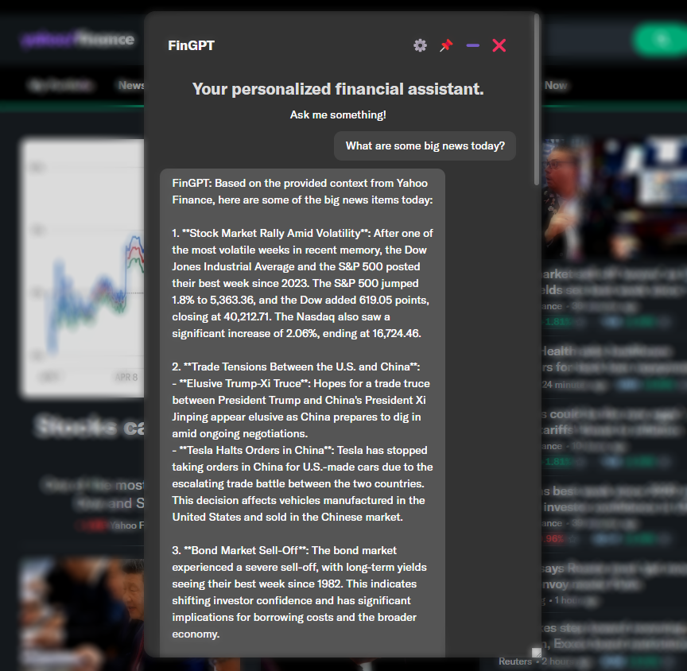
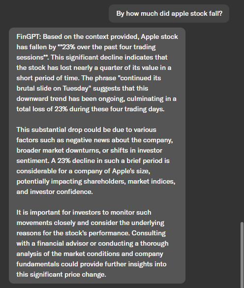

# FinGPT Search Agents

Vision: A financial agent to assist users in information retrieval and data analysis. It provides the information sources of generated responses to help users evaluate the responses' quality.
 
This is a demo of FinLLM Leaderboard on HuggingFace's [Open Financial LLM Leaderboard](https://huggingface.co/spaces/TheFinAI/Open-Financial-LLM-Leaderboard).

1. A powerful agent for retrieving financial information: financial websites (Yahoo Finance, Bloomberg, XBRL International) and local files (SEC 10K, XBRL files (eXtensible Business Reporting Language)).
2. A powerful answer engine: performs open search to quickly locate relevant financial information from various sources, such as websites, reports, filings, and databases
3. Users can check the sources of generated responses, ensuring reliability and accuracy.

**NO Trading Suggestions!**

Current Progress:

1. Snapshot of the search agent: drag, resize and minimize; Providing information on user's current page.
   

2. Checking sources, which are very important and help reduce misinformation.
   

3. Dedicated RAG for local files (SEC 10K, XBRL files).
   


## Installation, Usage, and more
Reference the [documentation](https://fingpt-search-agent-docs.readthedocs.io/en/latest/)!


Immediate Next Steps:
1. Integrate MCP servers for a proof-of-concept.
2. Integrate Deepseek.
3. Try to make the agent render LaTex.

Future Plans:
1. zkp demo.

Citing:

```
@inproceedings{tian2024customized,
  title={Customized fingpt search agents using foundation models},
  author={Tian, Felix and Byadgi, Ajay and Kim, Daniel S and Zha, Daochen and White, Matt and Xiao, Kairong and Liu, Xiao-Yang},
  booktitle={Proceedings of the 5th ACM International Conference on AI in Finance},
  pages={469--477},
  year={2024}
}
```


**Disclaimer: We are sharing codes for academic purposes under the MIT education license. Nothing herein is financial 
advice, and NOT a recommendation to trade real money. Please use common sense and always first consult a professional
before trading or investing.**
